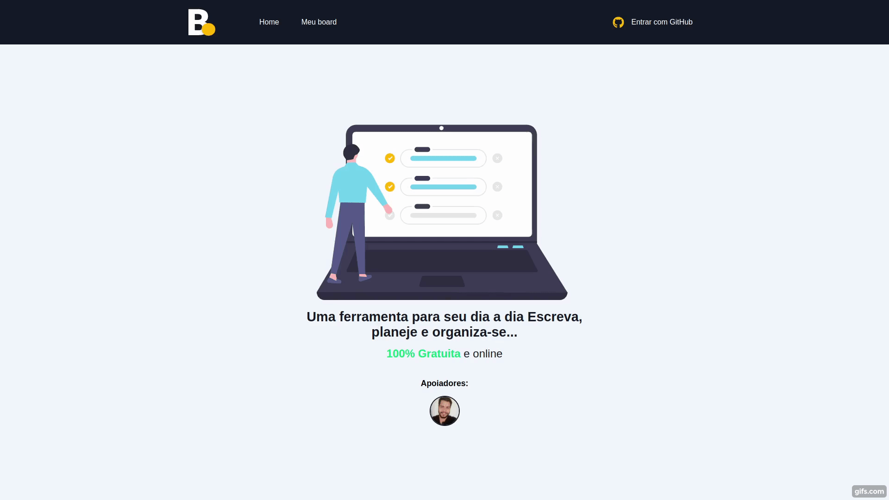

# Board

# Sobre o projeto

O projeto é um board de tarefas desenvolvido com NextJS e Firebase. Utilizei o NextAuth para gerenciar o acesso e as permissões do usuário ao sistema, foi implementado também um sistema de Donate com o PayPal, que ao fazer uma doação ao projeto o usuário libera algumas funcionalidades extras.

<b>Usuário deslogado</b>: Acesso apenas a página Home.

<b>Usuário logado</b>: Acesso ao board de tarefas e página de Donate.

<b>Usuário logado e que fez uma doação</b>: Acesso ao board, página de Donate, funcionalidades extras de editar, ver os detalhes de uma tarefa e visualizar quando foi feita a última doação.

## Demonstração 👨‍💻

## 💻 Projeto em produção

https://gsboard.herokuapp.com/

## 🚀 Tecnologias Usadas

- ✔️ [Next.js](https://pt-br.reactjs.org/)

- ✔️ [NextAuth](https://next-auth.js.org/)

- ✔️ [Typescript](https://www.typescriptlang.org/)

- ✔️ [Firebase](https://firebase.google.com/)

- ✔️ [React](https://pt-br.reactjs.org/)

- ✔️ [Sass](https://sass-lang.com/)
